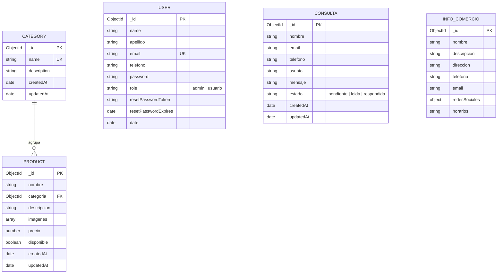

# 🛒 Plataforma Web para Pequeños Comercios - Backend API
> **Materia:** Aplicaciones Interactivas | **Cátedra:** TPO Segundo Cuatrimestre 2026  
> **Rubro del Comercio:** Tienda de Electrónica, Hardware, Simracing y Domótica  
> **Integrantes:** Ignacio Ubaldi y equipo

---

## 📌 1. Descripción Funcional del Sistema

La plataforma web es una solución integral desarrollada para un comercio del rubro tecnológico (**Tienda Electrónica & Hardware UADE**). El sistema se divide en dos áreas principales según los roles de usuario:

### 🌐 A. Sitio Público (Visitantes)
Cualquier visitante puede:
* Conocer la **información institucional** del comercio (historia, dirección, horarios de atención, teléfonos y redes sociales).
* Explorar el **catálogo de productos** organizados por categorías.
* Utilizar el **buscador por nombre** y filtrar productos por su **categoría** o **rango de precio**.
* Visualizar el **detalle de cada producto** con su precio, descripción técnica, disponibilidad y galería de imágenes.
* Enviar consultas mediante el **formulario de contacto público** (con almacenamiento en base de datos y aviso por email).

### 🔒 B. Panel de Administración (Administrador)
Los usuarios autorizados con rol `admin` disponen de una interfaz privada para:
* **Autenticación segura:** Inicio de sesión con JWT, cierre de sesión con lista negra de tokens y recuperación de contraseña vía token temporal.
* **Gestión de Publicaciones:** Crear, modificar, eliminar y activar/pausar publicaciones del catálogo (`disponible: true/false`).
* **Gestión de Categorías:** Crear, editar y eliminar categorías (con validación de integridad referencial para evitar productos huérfanos).
* **Gestión de Consultas:** Bandeja de entrada para visualizar mensajes de clientes, cambiar su estado (`pendiente`, `leida`, `respondida`) o eliminarlos.
* **Información Institucional:** Administrar y actualizar los datos de contacto y redes del negocio.

---

## 🗄️ 2. Modelo de Datos (Esquema de Base de Datos NoSQL)

El backend utiliza **MongoDB Atlas** con esquemas tipados y validados a través de **Mongoose**:



---

## 🧭 3. Diagrama de Navegación del Sistema

```mermaid
flowchart TD
    subgraph Publico["Área Pública (Visitantes)"]
        Home["Inicio / Información Institucional"]
        Catalogo["Catálogo de Productos"]
        Detalle["Detalle de Producto"]
        Buscador["Búsqueda y Filtros por Categoría"]
        Contacto["Formulario de Contacto"]
        Login["Login / Recuperación de Contraseña"]
        
        Home --> Catalogo
        Catalogo --> Buscador
        Catalogo --> Detalle
        Home --> Contacto
        Home --> Login
    end

    subgraph Admin["Área Privada (Administrador - Token JWT)"]
        Dashboard["Panel Principal"]
        ABMProductos["Gestión de Productos (Crear, Editar, Pausar, Borrar)"]
        ABMCategorias["Gestión de Categorías"]
        BandejaConsultas["Bandeja de Consultas (Pendientes, Leídas, Respondidas)"]
        AdminInfo["Editar Información del Comercio"]
        
        Login -.->|Autenticación Exitosa (role: admin)| Dashboard
        Dashboard --> ABMProductos
        Dashboard --> ABMCategorias
        Dashboard --> BandejaConsultas
        Dashboard --> AdminInfo
    end
```

---

## 🚀 4. Manual de Instalación y Puesta en Marcha

### Prerrequisitos
* **Node.js** (v14 o superior instalado).
* **npm** (gestor de paquetes).
* Conexión a Internet para acceder al clúster de **MongoDB Atlas**.

### Pasos de Instalación

1. **Clonar el repositorio:**
   ```bash
   git clone https://github.com/NachoUbaldi/TP-TiendaElectronica-Backend.git
   cd TP-TiendaElectronica-Backend
   ```

2. **Instalar dependencias:**
   ```bash
   npm install
   ```

3. **Configurar variables de entorno:**
   Crear un archivo `.env` en la raíz tomando como base `.env.example`:
   ```env
   SECRET=supersecret
   PORT=4000
   MONGO_URI="mongodb+srv://<usuario>:<password>@<cluster>.mongodb.net/tienda_electronica"
   ```

4. **Poblar la base de datos (Script de Creación):**
   Ejecutar el script de seed para precargar las 4 categorías, 23 productos reales, información de comercio y usuario administrador:
   ```bash
   npm run seed
   ```
   *Credenciales de administrador por defecto:*  
   * **Email:** `admin@tienda.com`  
   * **Password:** `admin123`

5. **Iniciar el servidor:**
   * Modo desarrollo con recarga automática:
     ```bash
     npm run dev
     ```
   * Modo producción:
     ```bash
     npm start
     ```
   El servidor quedará escuchando en `http://localhost:4000`.

---

## 📡 5. Resumen de Endpoints de la API REST

### Categorías (`/api/categories`)
* `GET /api/categories`: Listar todas las categorías (Público).
* `GET /api/categories/:id`: Obtener una categoría por ID (Público).
* `POST /api/categories`: Crear categoría (Admin).
* `PUT /api/categories/:id`: Modificar categoría (Admin).
* `DELETE /api/categories/:id`: Eliminar categoría (Admin, valida que no tenga productos asociados).

### Productos (`/api/products`)
* `GET /api/products`: Listar productos con filtros (`?nombre=`, `?categoria=`, `?disponible=`, `?minPrecio=`, `?maxPrecio=`) (Público).
* `GET /api/products/:id`: Detalle de producto por ID (Público).
* `POST /api/products`: Crear producto (Admin).
* `PUT /api/products/:id`: Modificar producto completo (Admin).
* `PATCH /api/products/:id/disponible`: Activar/Desactivar publicación (Admin).
* `DELETE /api/products/:id`: Eliminar publicación (Admin).

### Consultas de Contacto (`/api/consultas`)
* `POST /api/consultas`: Enviar mensaje de contacto (Público).
* `GET /api/consultas`: Bandeja de entrada de consultas (Admin).
* `PUT /api/consultas/:id`: Cambiar estado (`pendiente`, `leida`, `respondida`) (Admin).
* `DELETE /api/consultas/:id`: Eliminar consulta (Admin).

### Información Institucional (`/api/info`)
* `GET /api/info`: Obtener datos institucionales del negocio (Público).
* `PUT /api/info`: Modificar datos institucionales (Admin).

### Usuarios y Autenticación (`/api/users`)
* `POST /api/users/registration`: Registro de nuevos usuarios.
* `POST /api/users/login`: Inicio de sesión (retorna token JWT y rol).
* `POST /api/users/logout`: Cierre de sesión (invalida el token).
* `GET /api/users/profile`: Obtener perfil autenticado (Requiere Token).
* `PUT /api/users/update`: Modificar datos personales (Requiere Token).
* `POST /api/users/forgot-password`: Solicitar token de restablecimiento.
* `POST /api/users/reset-password`: Restablecer contraseña con token.
